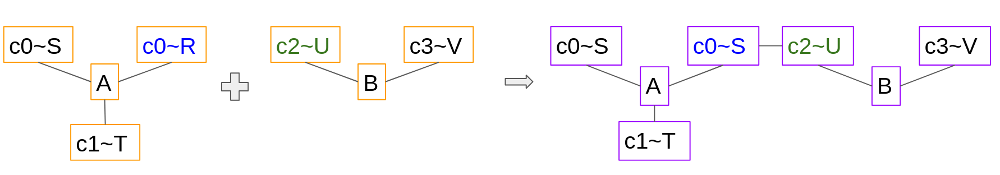
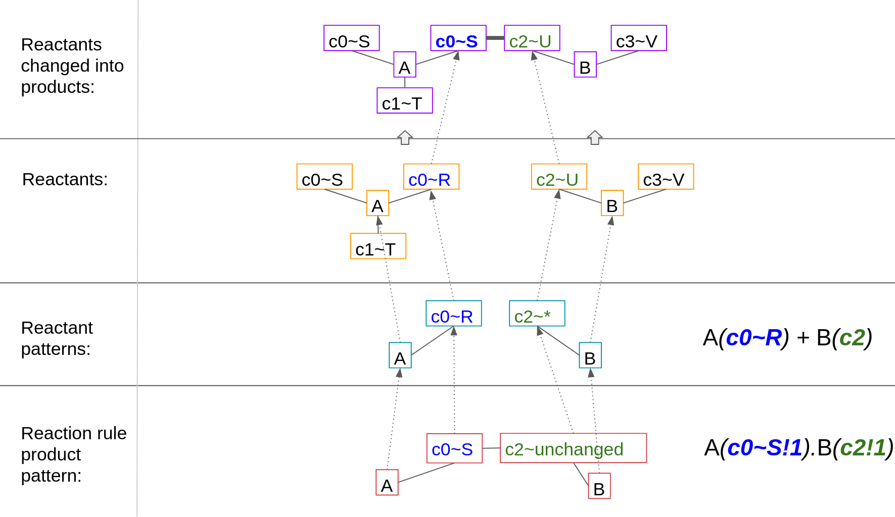
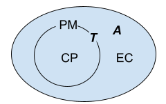

**************************
BioNetGen Language Support
**************************

MCell4 uses BioNetGen rule-based definition formalism to define species and reaction rules.
Documentation on the BioNetGen language (BNGL) can be found on the official `BioNetGen website <http://bionetgen.org/>`_.
This section contains a short overview of BNGL with described limitations and extensions.  

Loading a BNGL File
###################

A file in BioNetGen language can be loaded directly from MCell4 Python model without any previous conversions like this: 

.. code-block:: python

   model = m.Model()
   ...
   # load our BNGL file and set directory for BNGL observables
   model.load_bngl('model.bngl', './react_data/seed_' + str(SEED).zfill(5) + '/')

Calling *load_bngl* invokes a BNGL parser and the parsed data are converted internally into MCell4 classes. 
For more details see Model.load_bngl (that loads the full BNGL file), or methods that load only partial information:
Subsystem.load_bngl_molecule_types_and_reaction_rules, Instatiation.load_bngl_compartments_and_seed_species,
Observables.load_bngl_observables, and bngl_utils.load_bngl_parameters. 

Terminology
###########

A *component type* is a template for components that defines name and all allowed states of a *component*.
An *elementary molecule type* is a template for elementary molecules that defines name and all 
component types used by an *elementary molecule*. 

Example in BNGL:

.. code-block:: text

   begin molecule types
       # simple elementary molecule type 'A' that has no components
       A          
       # elementary molecule type 'B' that uses a single component type 'c' with no states
       B(c)      
       # elementary molecule type 'C' that uses a single component type 'b' with states 'A' and 'B'
       C(b~A~B)  
   end molecule types

A BNGL *complex* is defined as a set of *elementary molecules* where each elementary molecule may contain *components*.
These components may have *state* and *bond* declared. Through bonds, the elementary molecules are linked together.

A complex is either a pattern where not all components need to be specified or a fully-specified complex
where all contained elementary molecules contain all components for their type, and their states are set.  

.. code-block:: text

   # block seed species defines initial molecules in a simulation
   # all complexes used here must be fully-qualified
   begin seed species
       # complex with a single elementary molecule A, the initial count is 10
       A 10
                
       # complex with a single elementary molecule C with component b state set to A
       C(b~A)  

       # complex composed of elem. molecules B and C bound through components
       B(c!1).C(b~A!1)      
   end molecule types

   # block observables defines what patterns will be counted, 
   # the complexes used here do not have to be fully-qualified
   begin observables
       # pattern with a single elementary molecule A, name of the observable is obs_A 
       Molecules obs_A A
                
       # pattern matching a molecule C with any component state, bound or unbound  
       Molecules obs_C C  

       # pattern matching a molecule C with component's b state A, component b must be unbound  
       Molecules obs_CbA C(b~A)  

       # pattern matching a molecule that has both B and C with any component states
       # (in our example, the only complexes that match must be bound but the pattern does not require it)  
       Molecules obs_CB B.C  
             
   end observables

What we call elementary molecule is in BNGL usually called just molecule, but we needed to be precise 
because in the MCell context, the term *molecule* is a single simulated agent.
Each MCell molecule has a *species* assigned that defines its type. 
A species is represented by a fully-specified complex.

Reaction Rules
##############

Simple Reaction Rules
*********************

We will start with a simple example of a reversible bimolecular reaction.

.. code-block:: text

   begin reaction rules
      A + B <-> C fwd_rate, rev_rate
   end reaction rules

All reaction rules in MCell follow the law of mass action and 
this particular rule tells us that when molecule of species A hits a molecule of species B,
then with a probability given by fwd_rate, a reaction can occur that transforms A and B into C. 
This is a reversible reaction rule, so also a unimolecular reaction is defined for C to split into 
A and B and the probability of this happening is given by rev_rate.   

Graph Transformations
*********************

A reaction rule in BNGL defines a graph transformation that creates or removes bonds, changes states, or
adds or removes elementary molecules. We will demonstrate this graph transformation on an example:

.. code-block:: text

   begin molecule types
      # A has two identical component types 
      A(c0~R~S, c0~R~S)
      # B has two different component types (although their states are named identically)
      B(c2~U~V, c3~U~V)
   end molecule types
    
   begin reaction rules
      A(c0~R) + B(c2) -> A(c0~S!1).B(c2!1) rate
   end reaction rules

The reaction rule makes a bond between A's component c0 with B's c2 and also changes the state of A's c0 from R to S
as shown in the following image:

The way this transformation works is shown in the following image.
Our inputs are reactants (2nd row). A mapping from each elementary molecules and each component 
from *reactant patterns* onto *reactants* is computed. All elementary molecules and components must be mapped otherwise 
the rule cannot be applied. There can be multiple mappings in general, but there is just one in our example. 

The next step is to compute a mapping of elementary molecules and components from the 
*reaction rule product pattern* onto reactant patterns.

The difference between the reaction rule product pattern and the reactant patterns
tells us what changes need to be made. In this instance, a bond between A's c0 with state R and B's c2 
is created,d the same A's component's c0 state is changed to S.

Once we have our mappings, we can follow the arrows leading from the 
reaction rule product pattern to reactant patterns and then to reactants and do exactly these changes on the 
reactants, as shown in the row *reactants changed into products*.

Reaction Rates
**************

MCell and BioNetGen use different units for bimolecular kinetic rates.
In MCell, a volume-volume reaction (reaction between two molecules
that are free to diffuse in 3D space) is M\ :sup:`-1`\*s\ :sup:`-1`\ where 
M is the molar concentration (number of moles per liter).
In BioNetGen, the user is not constricted to a specific unit but a usual unit 
is N\ :sup:`-1`\*s\ :sup:`-1`\ where N is a number of molecules per compartment
and the default compartment volume if a compartment is not specified is 1fl (= 1 um\ :sup:`3`\).

To convert from BioNetGen to MCell units, one needs to multiply the
BioNetGen rate by NA * V where NA is Avogardro's constant and V is volume 
of the compartment is liters as derived here:

1/M = 1/(#moles/V) = 1/( (N/NA)/V) = NA * V * 1/N

The unimolecular reaction rates in MCell and BioNetGen both use unit s\ :sup:`-1`\. 

MCell Parameter Prefixes
########################

To simplify interoperability between BioNetGen and MCell, special parameters 
with reserved prefixes and names are used to provide the information needed by MCell such as diffusion constants. 

**MCELL_REDEFINE_** - allows a parameter to have a different value in MCell and for BioNetGen.
Example:

.. code-block:: text

    begin parameters
      NA_um3 6.022e8
      VOL_RXN 1
      # we will redefine the parameter VOL_RXN for MCell 
      MCELL_REDEFINE_VOL_RXN NA_um3
      
      # the BioNetGen value of the parameter kp1 is 1 but for MCell 
      # it is 6.022e8 * 1
      kp1 VOL_RXN * 1
    end parameters
  
**MCELL_DIFFUSION_CONSTANT_3D_**, **MCELL_DIFFUSION_CONSTANT_2D_** - allows to specify a diffusion constant for a 3D (volume) or 2D (surface) elementary molecule
type. 

.. code-block:: text
   
   begin parameters
     MCELL_DIFFUSION_CONSTANT_3D_V 1e-6
     MCELL_DIFFUSION_CONSTANT_2D_S 1e-7
   end parameters

   begin molecule types
     V
     S
   end molecule types

All these parameter prefixes are ignored by the BioNetGen tools and are interpreted as 
any other parameter.

Compartments and Orientations
#############################

BNGL compartments allow to define hierarchical volumes or surfaces where molecules are located. 
With compartments, one can define e.g. a transport reaction where a molecule that usually diffuses 
in volume is transported by a channel located in a membrane into another volume compartment. 
Let's say we need to define a reaction where a volume molecule A in a volume/3D compartment 
reacts with a surface molecule T (transporter) in a surface compartment as shown in Fig. X7. 

An example of compartments is shown in the following figure. 
EC is extracellular space, PM is plasma membrane, and CP is cytoplasm. 
A is a molecule that diffuses freely in 3D space, and T is located in a membrane.

In BNGL, a reaction that defines transport of A from compartment EC into CP is represented like this: 
A\@EC + T\@PM -> A\@CP + T\@PM. An issue arises when one needs to model multiple instances of cells or organelles. 
A compartment is a specific object in the simulation. If we wanted to simulate multiple cells, we would need 
to repeat the definition of this reaction rule for 
each cell (with PM1, PM2, ...) e.g. like this: A\@EC + T\@PM1 -> A\@CP1 + T\@PM1, A\@EC + T\@PM2 -> A\@CP2 + T\@PM2, etc. 

To avoid the repetition of reaction rules for each compartment and to keep the BNG language consistent, 
an extension to the BNG language that uses compartment classes \@IN and \@OUT was introduced. 
The original BNG reaction with specific compartments is more generally represented as A\@OUT + T -> A\@IN + T. 
Only bimolecular reactions with one volume a one surface reactant may use \@IN or \@OUT compartment classes because 
the compartment of the surface reactant defines the meaning of the \@IN and \@OUT compartment class of the volume reactant.

When this rule is applied to reactants A\@EC and T\@CP, we know that the compartment of T is PM, the compartment outside (parent) 
is EC, and inside is CP. So, we insert this information to the rule A\@OUT + T -> A\@IN + T and get A\@EC + T\@PM -> A\@CP + T\@PM 
(same as the example rule we started with). 

MCell3 used molecule orientations to limit which surface and volume reactions can occur. 
A surface molecule S could be released or created as a product in two different states S' (UP) and S, (DOWN).
This behavior was deprecated in MCell4 and all surface molecules are by default created with orientation UP.
If specific orientation is needed, one can use a component with state such as S(orient~UP~DOWN).

Limitations
###########

This section lists the limitations of the MCell4 BNGL support compared to the BioNetGen tools.

- Section `functions` is not supported, and loading a file with BNGL functions will report an error. 
- The only reaction kinetics supported is the law of mass action, BNG supports others through keywords but
  the MCell4 parser will report an error.
- Actions such as `generate_network` or `simulate` are silently ignored.
