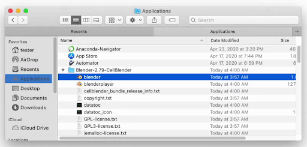
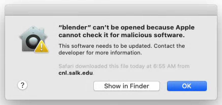
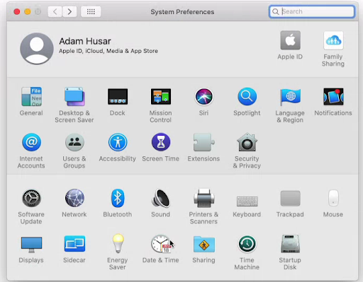
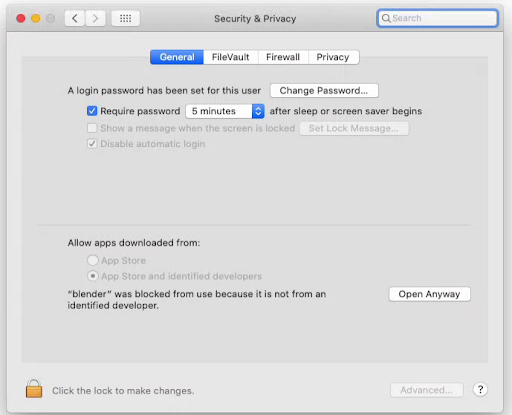
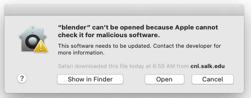
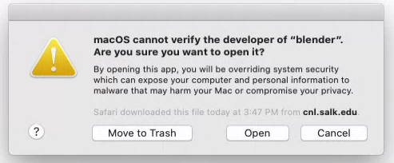
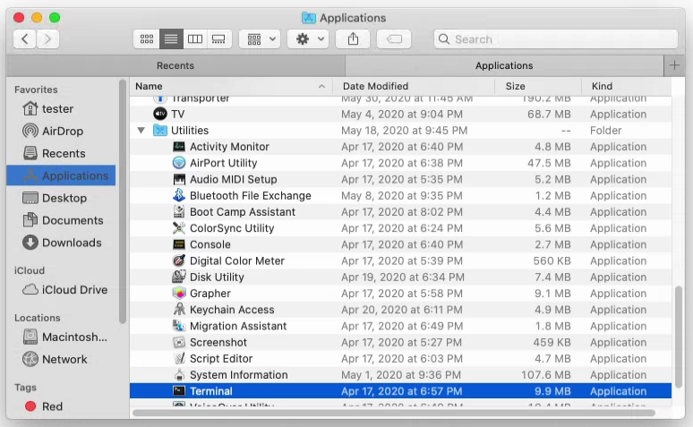
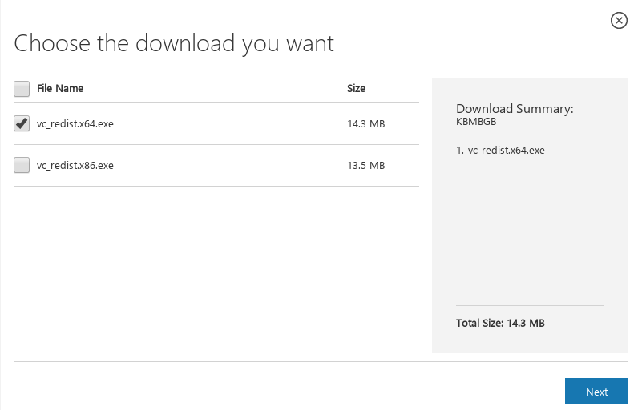

*******************
MCell4 Installation
*******************

Download
########

CellBlender bundle containing MCell4 is available for download 
for different operating systems at the MCell.org website: `<https://mcell.org/download.html>`_.

Installation
############

MacOS
*****

After downloading, the zip file will be automatically extracted to your downloads directory. 
Move the Blender-2.79-CellBlender directory to Applications (i.e., to the directory /Applications). 
The CellBlender bundle won't work correctly in any other directory.

MCell4 build is known to work also on the latest Apple MacBooks with ARM processor M1.

MacOS Mojave and Older
----------------------
 
If you have an older version of MacOS than the Catalina MacOS, you can skip  
to the following section `Running Blender On MacOS`_. The following setup is not needed and the only 
thing required is that the unpacked bundle is under the directory /Applications.
 

Start Blender by double-clicking the blender application file. 

Although the package is digitally signed, some newer MacOS versions require extra approvals from Apple, 
for now, you will most probably get one of the following warnings:

.. image:: images/installation_macos_warning1.png

Click on **Cancel** or on **OK** and then open System Preferences (through the Apple menu in the top left). 
Select Security and Privacy.

In the Security & Privacy settings, click on **Open Anyway**.

One more warning appears; select **Open**.

Now quit Blender and start it from the terminal, as shown in the following section. 
This will allow you to see additional messages printed by CellBlender. 
It also allows one to overcome a settings saving issue on MacOS Catalina (described in section 2.2).

Running Blender On MacOS
------------------------

Open a terminal window; terminal can be found under Applications and Utilities.

Run the following commands from the terminal:

.. code-block:: text

      cd /
      /Applications/Blender-2.79-CellBlender/my_blender

By now, CellBlender should be up and running; however, if you get a message that the application 
is damaged, please see section `Common Troubleshooting`_.

Linux
*****

Unpacking the CellBlender Package
---------------------------------

Start a terminal window and run the following command where <path_to_bundle.tar.gz> is the path 
where you downloaded the CellBlender bundle and <target_directory> is the desired installation directory:

.. code-block:: text

      tar -xf <path_to_bundle.tar.gz> -C <target_directory>

Running Blender on Linux
------------------------

From a terminal, run the following command:

.. code-block:: text

      <target_directory>/Blender-2.79-CellBlender/my_blender

Windows
*******

Installing Strawberry Perl
--------------------------

Interpreter of the Perl programming language is not usually present on Windows,
so one needs to install it before using CellBlender when importing BNGL files into CellBlender or 
when using MCell3R. Perl is not needed to run MCell4.
  
From `<http://strawberryperl.com/>`_, download the 64-bit variant (strawberry-perl-5.30.2.1-64bit.msi) 
and install it.
If you have any troubles installing it, please follow the parts related to Strawberry Perl here:
`<https://mcell.org/downloads/windows/install_2019_05/index.html>`_.

Installing Microsoft Visual C++ 2015 Redistributable Update 3 RC
----------------------------------------------------------------

Python requires windows library VCRUNTIME140.DLL to be present under C:\windows\system32\. 
To install it, download file vc_redist_x64.exe from here and install it:
`<https://www.microsoft.com/en-us/download/details.aspx?id=52685>`_.

Unpacking the CellBlender Archive
---------------------------------

Find the file Blender-2.79-CellBlender-<version>-Windows-<date>.tar.gz in 
Explorer, right-click and select *Extract here*. 

Running Blender on Windows
--------------------------

Start Windows terminal (click on Start, then type cmd, then enter). 
Then run the following command where <target_directory> is the directory 
to which you unpacked CellBlender:

.. code-block:: text

      <target_directory>\Blender-2.79-CellBlender\blender.exe

  
Setting System Variable MCELL_PATH
##################################

MCell4 Python models use the system variable *MCELL_PATH* to locate 
the MCell4 library. It is also useful as a shortcut to the location of utility scripts 
contained in the CellBlender bundle.

The models generated by CellBlender expect a system variable *MCELL_PATH* to 
be defined and use it to add this path (appended with 'lib') to the 
Python's search paths like this:

.. code-block:: python

      MCELL_PATH = os.environ.get('MCELL_PATH', '')
      sys.path.append(os.path.join(MCELL_PATH, 'lib'))
      
      import mcell as m

One can also use the standard system variable 
`PYTHONPATH <https://docs.python.org/3/using/cmdline.html#envvar-PYTHONPATH>`_ 
for the same purpose, but the CellBlender tools use the *MCELL_PATH* variable.

MacOS
*****

Open the file *~/.bash_profile* in your text editor - e.g. *atom ~/.bash_profile*
and append the following line to the end of the file:

.. code-block:: text

   export MCELL_PATH=/Applications/Blender-2.79-CellBlender/blender.app/Contents/Resources/2.79/scripts/addons/cellblender/extensions/mcell/

You must open a new terminal for this change to take effect. 

Linux
*****

Open the file *~/.bashrc* in your text editor - e.g. *gedit ~/.bashrc*
and append the following line to the end of the file 
(replace *<blender_dir>* with the CellBlender bundle installation directory).

.. code-block:: text

   export MCELL_PATH=<blender_dir>/2.79/scripts/addons/cellblender/extensions/mcell

You must open a new terminal for this change to take effect. 

Windows
******* 

Go to the Windows menu, right-click on *Computer* and select *Properties*.
From the computer properties dialog, select *Advanced system settings* on the left.
From the advanced system settings dialog, choose the *Environment variables* button.

In the Environment variables dialog, click the *New* button in the top half of the dialog 
to make a new user variable. Give the variable name as MCELL_PATH and the value is the following path 
(replace *<blender_dir>* with the CellBlender bundle installation directory):

.. code-block:: text

   <blender_dir>/2.79/scripts/addons/cellblender/extensions/mcell
   
Choose OK and OK again to save this variable.

You must open a new terminal for this change to take effect. 

Common Troubleshooting
######################

Loading Factory Settings
************************

Blender keeps setting in a user directory, so settings from a previous installation might 
be loaded and cause various incompatibility issues. 
If you encounter any issues with CellBlender, the first recommended step is to reset settings. 
It is done through Blender menu *File* -> *Load Factory Settings*.

MacOS: Error When Saving CellBlender Settings
*********************************************

When saving settings an error "cannot open file /private/var/.../blender.app/Contents/Resources/..." 
can be printed.

On MacOS Catalina and newer, the area where Blender stores its settings is protected. 

The first step is to try to run Blender from a terminal as shown in section `Running Blender On MacOS`_,
i.e., by running this script:

.. code-block:: text

      /Applications/Blender-2.79-CellBlender/my_blender 

Then try to save the setting again. If that won't help, continue with setting permissions for 
terminal to access all folders as shown `here <https://osxdaily.com/2018/10/09/fix-operation-not-permitted-terminal-error-macos/>`_.

MacOS: Remove "application downloaded from internet" Attribute
**************************************************************

This step might be useful for releases older than 3.5.0 on MacOs Catalina.

The *xattr* command can be used to remove the 'application downloaded from the internet' error message. 
This can, for instance, be an issue on MacOS Catalina where the checking is more strict. To fix this, run:

.. code-block:: text

      xattr -cr /Applications/Blender-2.79-CellBlender/blender.app

Windows: Plotting does not work
*******************************

There might be a collision with a different installation of Python on your system. 
To fix this, start the Windows terminal, navigate to the Blender-2.79-CellBlender directory, 
and then run these commands to start CellBlender:

.. code-block:: text

      set PYTHONPATH=
      blender.exe

