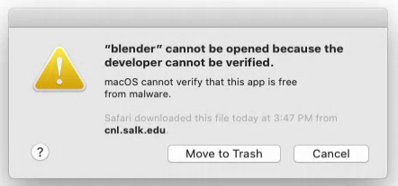

*******************
MCell4 Installation
*******************

Download
########

CellBlender bundle containig MCell4 is available for download 
for different operating systems at the MCell.org website: `<https://mcell.org/download.html>`_.

Installation
############

MacOS
*****

After downloading, the zip file will be automatically extracted to your downloads directory. 
Move the Blender-2.79-CellBlender directory to Applications (i.e. to the directory /Applications). 
The CellBlender bundle won’t work correctly in any other directory.

MCell4 build is known to work also on the latest Apple MacBooks with ARM processor M1.

MacOS Mojave and Older
----------------------
 
If you have an older version of MacOS than the Catalina MacOS, you can skip  
to the following section `Running Blender On MacOS`_ because the following setup is not needed and the only 
thing required is that the unpacked bundle is under the directory /Applications.
 

Start Blender by double-clicking the blender application file. 

Although the package is digitally signed, some newer MacOS versions require extra approvals from Apple, 
for now, you will most probably get one of the following warnings:

.. image:: images/installation_macos_warning2.png

Click on **Cancel** or on **OK** and then open System Preferences (through the Apple menu in the top left). 
Select Security and Privacy.

.. image:: images/installation_macos_security_and_privacy.png

In the Security & Privacy settings click on **Open Anyway**.

.. image:: images/installation_macos_security_and_privacy_selected.png

One more warning appears, select **Open**.

.. image:: images/installation_macos_warning3.png

Now quit Blender and start it from the terminal as shown in the following section. 
This will allow you to see additional messages printed by CellBlender. 
It also allows one to overcome a settings saving issue on MacOS Catalina (described in section 2.2).

Running Blender On MacOS
------------------------

Open a terminal window, terminal can be found under Applications and Utilities.

Run the following commands from the terminal:

.. code-block:: text

      cd /
      /Applications/Blender-2.79-CellBlender/my_blender

By now, CellBlender should be up and running, however, if you get a message that the application 
is damaged, please see section `Common Troubleshooting`_.

Linux
*****

Unpacking the CellBlender Package
---------------------------------

Start a terminal window and run the following command where <path_to_bundle.tar.gz> is the path 
where you downloaded the CellBlender bundle and <target_directory> is the desired installation directory:

.. code-block:: text

      tar -xf <path_to_bundle.tar.gz> -C <target_directory>

Running Blender on Linux
------------------------

From a terminal run the following command:

.. code-block:: text

      <target_directory>/Blender-2.79-CellBlender/my_blender

Windows
*******

Installing Strawberry Perl
--------------------------

Interpreter of the Perl programming language is not usually present on Windows
so one needs to install it before using CellBlender when importing BNGL files into CellBlender or 
when using MCell3R. It is not needed to run MCell4.
  
From `<http://strawberryperl.com/>`_, download the 64-bit variant (strawberry-perl-5.30.2.1-64bit.msi) 
and install it.
If you will have any troubles installing it, please follow the parts related to Strawberry Perl here:
`<https://mcell.org/downloads/windows/install_2019_05/index.html>`_.

Installing Microsoft Visual C++ 2015 Redistributable Update 3 RC
----------------------------------------------------------------

Python requires windows library VCRUNTIME140.DLL to be present under C:\windows\system32\. 
To install it, download file vc_redist_x64.exe from here and install it:
`<https://www.microsoft.com/en-us/download/details.aspx?id=52685>`_.

.. image:: images/installation_win_redist.png

Unpacking the CellBlender Archive
---------------------------------

Find the file Blender-2.79-CellBlender-<version>-Windows-<date>.tar.gz in 
Explorer, right-click and select *Extract here*. 

Running Blender on Windows
--------------------------

Start Windows terminal (click on Start, then type cmd, then enter). 
Then run the following command where <target_directory> is the directory 
to which you unpacked CellBlender:

.. code-block:: text

      <target_directory>\Blender-2.79-CellBlender\blender.exe

  
Setting System Variable MCELL_PATH
##################################

To run MCell4 model directly using Python and not through CellBlender,
the models generated by CellBLender expect a system variable *MCELL_PATH* to 
be defined.

Linux and MacOS
***************

TODO

Windows
******* 

TODO

Common Troubleshooting
######################

TODO

