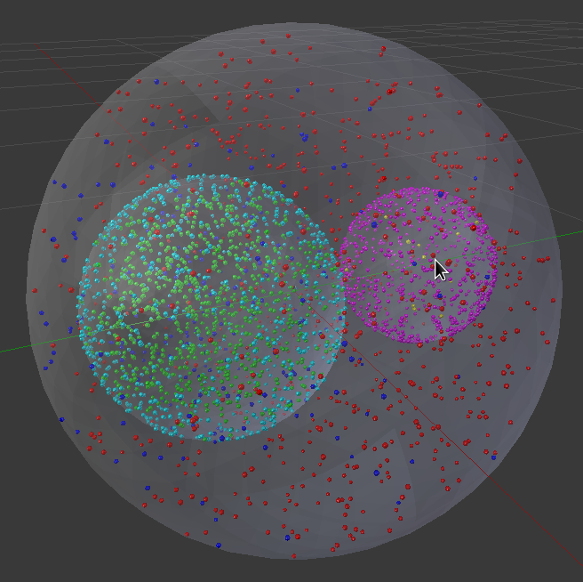

*******************
Python API Tutorial
*******************

Overview
########

This tutorial shows how to use MCell4 Python API with BioNetGen language to construct a model of a cell with two organelles
that uses volume-volume and volume-surface reactions. 
You will gradually build, simulate, and visualize the model and after completing all the steps, this will be the result:   

  

Using the Tutorial
##################

The tutorial is provided as a series of Python files where each file 
is a runnable model.

These tutorial files serve as guidelines and the recommended usage of the tutorial
is to write your own model file by following steps in these individual files 
and copying code snippets from there int your file. 

Each explanation is a multiline comment starting with the section index followed 
by the index of the comment as shown below:

.. code-block:: python

      """
      0010-1)
      The main difference ...
  
To highlight changes in the subsequent sections, the explanations 
from a previous section are removed and replaced with a reference 
to the comment index so that it can be found in the preceding files if needed.

.. code-block:: python

      #0010-1)
      """
      0020-1)
      In the previous section ...
  
  
In the BioNetGen language, no multiline comments are allowed, so 
previous comment indices are prefixed with ## and the new ones with just one #.

.. code-block:: python

      ## 0030-3)
      # 0040-3)
      # Specify ...

  
  
Tutorial Sections
#################

0. | Diffusion of a volume molecule
   | `0000_vol_mol_diffusion/model.py <https://github.com/mcellteam/mcell_tests/tree/mcell4_dev/tests/tutorial/0000_vol_mol_diffusion/model.py>`_ 
   | `0000_vol_mol_diffusion/viz.blend <https://github.com/mcellteam/mcell_tests/blob/mcell4_dev/tests/tutorial/0000_vol_mol_diffusion/viz.blend>`_ 
 
1. | Adding a box to the model
   | `0010_vol_mol_diffusion_in_box/model.py <https://github.com/mcellteam/mcell_tests/tree/mcell4_dev/tests/tutorial/0010_vol_mol_diffusion_in_box/model.py>`_ 
 
2. | Replacing the box with an icosphere
   | `0020_vol_mol_diffusion_in_icosphere/model.py <https://github.com/mcellteam/mcell_tests/tree/mcell4_dev/tests/tutorial/0020_vol_mol_diffusion_in_icosphere/model.py>`_ 
 
3. | Defining species and molecule releases with BNGL (BioNetGen language)
   | `0030_mol_release_with_bngl_and_compartments/model.py <https://github.com/mcellteam/mcell_tests/tree/mcell4_dev/tests/tutorial/0030_mol_release_with_bngl_and_compartments/model.py>`_
   | `0030_mol_release_with_bngl_and_compartments/model.bngl <https://github.com/mcellteam/mcell_tests/blob/mcell4_dev/tests/tutorial/0030_mol_release_with_bngl_and_compartments/model.bngl>`_
 
4. | Volume-volume and volume-surface reaction definition with BNGL
   | `0040_vol_and_surf_reactions/model.py <https://github.com/mcellteam/mcell_tests/tree/mcell4_dev/tests/tutorial/0040_vol_and_surf_reactions/model.py>`_ 
   | `0040_vol_and_surf_reactions/model.bngl <https://github.com/mcellteam/mcell_tests/blob/mcell4_dev/tests/tutorial/0040_vol_and_surf_reactions/model.bngl>`_
 
5. | Counting molecules 
   | `0050_counting/model.py <https://github.com/mcellteam/mcell_tests/tree/mcell4_dev/tests/tutorial/0050_counting/model.py>`_ 
   | `0050_counting/model.bngl <https://github.com/mcellteam/mcell_tests/blob/mcell4_dev/tests/tutorial/0050_counting/model.bngl>`_
 
6. | Complete organelle model
   | `0060_full_organelle_model/model.py <https://github.com/mcellteam/mcell_tests/tree/mcell4_dev/tests/tutorial/0060_full_organelle_model/model.py>`_ 
   | `0060_full_organelle_model/model.bngl <https://github.com/mcellteam/mcell_tests/blob/mcell4_dev/tests/tutorial/0060_full_organelle_model/model.bngl>`_
 
7. | Optimizing simulation performance
   | `0070_simulation_performance/model.py <https://github.com/mcellteam/mcell_tests/tree/mcell4_dev/tests/tutorial/0070_simulation_performance/model.py>`_ 
   | `0070_simulation_performance/model.bngl <https://github.com/mcellteam/mcell_tests/blob/mcell4_dev/tests/tutorial/0070_simulation_performance/model.bngl>`_
 